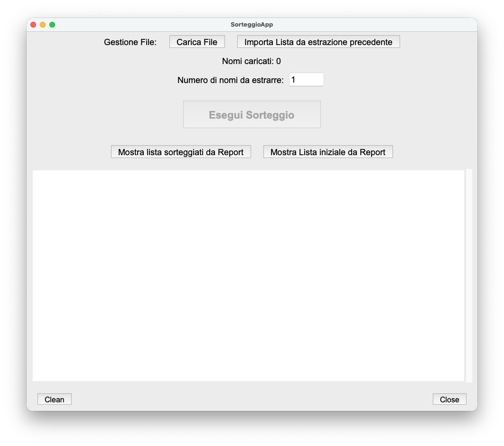

# Sorteggio Casuale

Applicazione Python con interfaccia grafica per estrarre nomi in modo casuale da un file di testo.
Il sorteggio deve essere equo e non prevedibile.

## Funzionalità

- Carica un file `.txt` contenente un nome per riga
- Specifica quanti nomi estrarre
- Interfaccia grafica semplice e autonoma
- Rilevamento e eliminazione di nomi duplicati
- Sorteggio casuale tramite `random.SystemRandom()`
	Basa il funzionamento sulla fonte di entropia del sistema operativo e non su generatori pseudo-casuali.
	Le occorrenze estrattei dipenderanno da eventi fisici e temporali (movimenti del mouse, interrupt hardware, jitter di CPU) non alterabili/prevedibili e riproducibili.
- Generazione report di estrazione con graduatoria finale

## Dettagli tecnici
- Fonte di entropia reale: 
	su Linux/macOS usa /dev/urandom; 
	su Windows usa CryptGenRandom() o API equivalenti.
- Equità statistica:
	ogni nome ha la stessa probabilità di essere selezionato.
- Sicurezza: 
	il processo non è deterministico, quindi non può essere riprodotto o manipolato tramite un seme noto.

## Requisiti

- Python 3.8 o superiore  
- Librerie standard (`tkinter`, `random`)  
- Per generare un `.exe`: `pyinstaller`

## Primo Avvio

Per essere eseguito in modalita' user-friendly e' necessaria la compilazione nell' ambiente di destinazione

1. **Avvia l’applicazione da windows**

	Lanciare script compile.bat, questo generera' un eseguibile nella cartella dist di progetto "SorteggioApp"
	Lanciare con doppio click l' eseguibile creato

2. **Avvia l’applicazione da linux/macOS**

	Lanciare script compile.sh, questo generera' un eseguibile nella cartella dist di progetto "SorteggioApp"
	Lanciare con doppio click l' eseguibile creato

3. **Avvia l’applicazione da cli**
   ```bash
   python3 SorteggioApp.py
   ```

4. **Verificare se un file e' stato manomesso**
	Lanciare da riga comando il seguente comando e confrontare gli hash. Se questi due coincidono il file non è stato alterato.
	Es.
	```bash
	sha256sum estrazione_20251031_184522.txt
	```

## Utilizzo



Tramite l'interfaccia principale e' possibile: 
1) selezionare file di input
	1.1) caricare una lista da file
	1.2) importa una lista nomi da una precedente estrazione, con possibilità di rimuovere le occorrenze già estratte
	per un ripescaggio
N.B. È importante che ogni occorrenza sia su una riga

2) digitare il numero di occorrenze da estrarre

3) Cliccare sul pulsante "Esegui Sorteggio".
N.B. 2
ad ogni sorteggio salva un report di estrazione su un file testuale nella stessa posizione del file sorgente. 
Il file riporterà un nome standard "estrazione_AAAAMMGG_HHmmss.txt"

4) se necessario effettuare un ripescaggio, tramite il pulsante "Importa lista da estrazione precedente" 
	sarà possibile rieseguire una nuova estrazione dalla lista codificata salvata nel report estrazione precedente.
	Sarà inoltre possibile scegliere se escludere o no dal ripescaggio le occorrenze già estratte.
N.B. 3 
Il report salvato dalla seconda estrazione riporterà come nuova "lista originale" la lista utilizzata.
Se sono state rimosse le occorrenze della prima estrazione, queste non saranno più visibili nel report del ripescaggio.
		 
	
